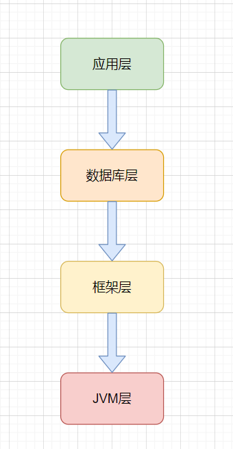
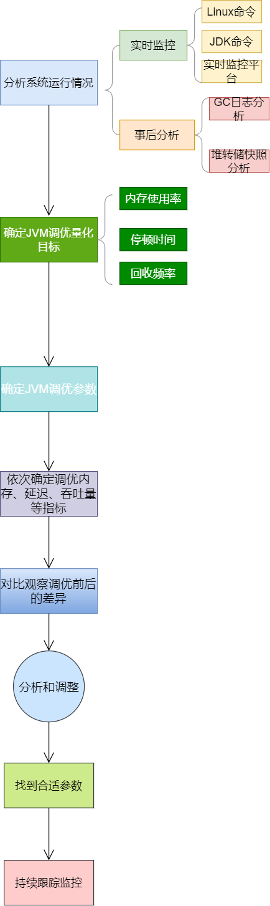

# JVM调优总结

## 1、调优原则

> JVM调优不是常规手段，性能问题一般第一选择是优化程序，最后的选择才是进行JVM调优。

## 2、JVM调优的时机

不得不考虑进行JVM调优的情况：

+ Heap内存（老年代）持续上涨达到设置的最大内存值；
+ Full GC 次数频繁；
+ GC 停顿时间过长（超过1秒）；
+ 应用出现OutOfMemory 等内存异常；
+ 应用中有使用本地缓存且占用大量内存空间；
+ 系统吞吐量与响应性能不高或下降。

## 3、JVM调优的目标

吞吐量、延迟、内存占用三者类似CAP，构成了一个不可能三角，只能选择其中两个进行调优，不可三者兼得。

+ 延迟：GC低停顿和GC低频率；
+ 低内存占用；
+ 高吞吐量;

选择了其中两个，必然会会以牺牲另一个为代价。

下面展示了一些JVM调优的量化目标参考实例：

+ Heap 内存使用率 <= 70%;
+ Old generation内存使用率<= 70%;
+ avgpause <= 1秒;
+ Full gc 次数0 或 avg pause interval >= 24小时 ;

## 4、JVM调优的步骤

一般情况下，JVM调优可通过以下步骤进行：

+ 分析系统系统运行情况：分析GC日志及dump文件，判断是否需要优化，确定瓶颈问题点；
+ 确定JVM调优量化目标；
+ 确定JVM调优参数（根据历史JVM参数来调整）；
+ 依次确定调优内存、延迟、吞吐量等指标；
+ 对比观察调优前后的差异；
+ 不断的分析和调整，直到找到合适的JVM参数配置；
+ 找到最合适的参数，将这些参数应用到所有服务器，并进行后续跟踪。

> 一般是从满足程序的内存使用需求开始的，之后是时间延迟的要求，最后才是吞吐量的要求，要基于这个步骤来不断优化，每一个步骤都是进行下一步的基础，不可逆行。

## 5、JVM参数