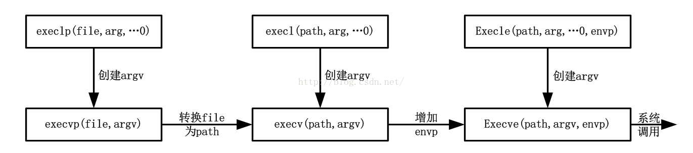

## 原文链接：https://blog.csdn.net/bad_good_man/article/details/49364947

### 1. fork函数原型

```shell
<pre name="code" class="cpp">#include<unistd.h>
pid_t fork(void);</span>
# 返回：在子进程中返回0，在父进程中返回子进程的id，出错返回-1.
```

---
如果之前从未接触过这个函数，**那么理解fork函数的最困难之处在于调用它一次，它却返回两次。**
它在调用进程（成为父进程）中返回一次，返回值为新派生进程（成为子进程）的进程ID号；在子进程中又返回一次，返回值为0.因此，返回值本身告知当前进程是子进程还是父进程。

fork在子进程中返回0而不是父进程的ID的原因在于：任何子进程只有一个父进程，而且子进程总是可以通过调用getppid取得父进程的ID。相反，父进程可以有许多子进程，而且无法获得各个子进程的进程ID。如果父进程想要跟踪所有子进程的ID，那么它必须记录每次调用fork的返回值。

父进程中调用fork之前打开所有的描述字在fork返回之后由子进程分享。我们将看到网络服务器便利用了这个特性：父进程调用accept之后调用fork。所接受的已连接的套接口随后就在父进程与子进程之间分享。通常情况下，子进程接着读和写这个套接口，父进程则关闭这个已连接套接口。

### 2. fork的用法

fork有两个典型的用法：

1. **一个进程创建一个自身的拷贝。**这样每个拷贝都可以在另外一个拷贝执行其他任务的同时处理各自的某个操作。
2. **一个进程想要执行另一个程序。**既然创建新进程的唯一方法为调用fork，该进程是首首先调用fork创建一个自身的拷贝，然后其中一个拷贝（通常为子进程）调用exec把自身替换成新的程序。

### 3. exec函数

存放在硬盘上的可执行文件能够被UNIX执行的唯一方法是：由一个现有进程调用六个exec函数中的某一个。exec把当前进程映像替换成新的进程文件，而且该新程序通常从main函数处开始执行。进程ID并不改变。我们称调用exec的进程为调用进程，称新执行的程序为新程序。

    六个exec函数的区别在于：
    （a）待执行的程序文件是由文件名还是由路径名指定；
    （b）新程序的参数是一一列出还是由一个指针数组来引用；
    （c）把调用进程的环境传递给新程序还是给新程序指定新的环境。

```shell
---------------------------------------------------------------------------
|#include<unistd.h>
|int execl(const char *pathname, const char *arg0,.../* (char *)0 */);
|int execv(const char *pathname, char *const argv[]);
|int execle(const char *pathname, const char *arg0,.../* (char *)0,char *const envp[] */);
|int execve(const char *pathname, char *const argv[], char *const envp[]);
|int execlp(const char *filename, const char *arg0,.../* (char *)0 */);
|int execvp(const char *filename, char *const argv[]);
|# 所有六个函数返回：-1——失败，无返回——成功
----------------------------------------------------------------------------
```

