> 线上故障主要会包括 CPU、磁盘、内存以及网络问题，而大多数故障可能会包含不止一个层面的问题，所以进行排查时候尽量四个方面依次排查一遍。同时例如
> jstack、jmap 等工具也是不囿于一个方面的问题的，基本上出问题就是 df、free、top 三连，然后依次 jstack、jmap 伺候，具体问题具体分析即可。

## CPU

一般来说先排查CPU方面的问题。原因包括业务逻辑的问题（死循环）、频繁GC以及上下文切换过多。最常见的是业务逻辑，可以使用jstack来分析对应的堆栈情况。

### 使用 jstack 分析 CPU 问题

1. 先用`ps`命令找到对应进程的pid  
    

2. 然后用`top -H -p pid`找到 cpu占用率高的线程  
    
   

3. 将占用最高的pid 转换为 16进制 `printf '%x\n' pid` 得到 nid  
    
   

4. 接着直接在`jstack`中找到相应的堆栈信息 `jstack pid | grep 'nid' -C5 -color`  
    
   

需要关注 `WAITING` 和 `TIMED_WAITING` or `BLOCKED`
的部分，可以用命令 `cat jstack.log | grep 'java.lang.Thread.State' | sort -nr | uniq -c` 来对`jstack`的状态有一个整体的把握，
需要留意 WAITING 之类的特别多的。

### 频繁 gc

使用`jstack`来分析问题，需要确定gc是否频繁，使用 `jstat -gc pid 1000`命令来对 gc 分代变化情况进行观察，1000 表示采样间隔（ms），
S0C/S1C、S0U/S1U、EC/EU、OC/OU、MC/MU 分别代表两个 Survivor 区、Eden 区、老年代、元数据区的容量和使用量。
YGC/YGT、FGC/FGCT、GCT 则代表 YoungGc、FullGc 的耗时和次数以及总耗时。

### 上下文切换

可以使用`vmstat`命令来进行查看

cs(context switch) -> 上下文切换的次数

对特定的pid进行切换可以使用 `pidstat -w pid` 命令，`cswch` 和 `nvcwch` 表示自愿及非自愿切换。

## 磁盘

磁盘问题和cpu问题一样属于比较基础。首先是从磁盘空间方面，使用 `df -hl` 来查看文件系统状态

更多时候，磁盘问题是性能上的问题。可以通过 `iostatiostat -d -k -x`来进行分析。

最后一列 `%util` 可以看到每块磁盘写入的程度，`rrqpm/s` 以及 `wrqm/s` 表示读写速度, 一般就能够定位哪块磁盘出现问题了。

> 有时候需要知道哪个进程在进行读写，使用 `iotop` 来进行定位文件读写的来源。

拿到 tid 需要转换成 pid，可以通过 `readlink` 找到 `pidreadlink -f /proc/*/task/../..`

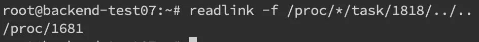

找到 pid 之后就可以看到进程的具体读写情况 `cat /proc/pid/io`

还能够通过 `lsof` 命令来确定具体的文件读写情况 `lsof -p pid`

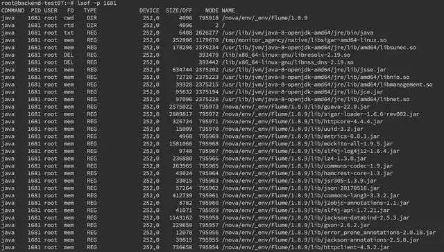

## 内存

内存问题排查相对于CPU会更加复杂，场景较多。主要包括 OOM、GC 问题和堆内存。先使用 `free` 命令检查内存情况。

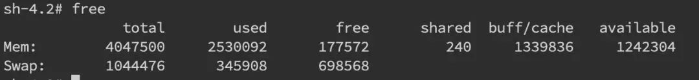

### 堆内内存

内存问题大多还都是堆内内存问题。表象上主要分为 OOM 和 Stack Overflow。

#### OOM

1. Exception in thread "main" java.lang.OutOfMemoryError: unable to create new native thread

   > 是没有足够的内存空间给线程分配 Java 栈, 本上还是线程池代码写的有问题，比如说忘记 shutdown，所以说应该首先从代码层面来寻找问题，使用
   > `jstack` 或者 `jmap`。如果一切都正常，JVM 方面可以通过指定Xss来减少单个 thread stack
   > 的大小。另外也可以在系统层面，可以通过修改`/etc/security/limits.confnofile` 和 `nproc` 来增大 os 对线程的限制

   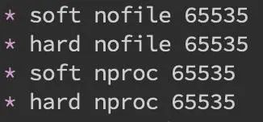

2. Exception in thread "main" java.lang.OutOfMemoryError: Java heap space

   > 堆的内存占用已经达到-Xmx 设置的最大值，应该是最常见的 OOM 错误了。解决思路仍然是先应该在代码中找，怀疑存在内存泄漏，通过
   `jstack` 和 `jmap` 去定位问题。如果说一切都正常，才需要通过调整Xmx的值来扩大内存。

3. Exception in thread "main" java.lang.StackOverflowError

   > 表示线程栈需要的内存大于 Xss 值，同样也是先进行排查，参数方面通过Xss来调整，但调整的太大可能又会引起 OOM。

   一般使用 `jmap -dump:format=b,file=filename pid`来导出 dump 文件，定位代码内存泄露  
    
   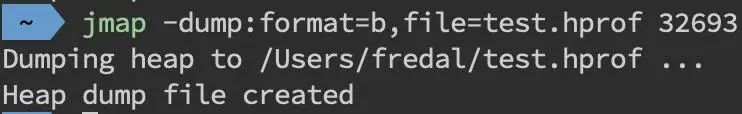

   通过 mat(Eclipse Memory Analysis Tools)导入 dump 文件进行分析，内存泄漏问题一般我们直接选` Leak Suspects` 即可，mat
   给出了内存泄漏的建议。另外也可以选择 `Top Consumers` 来查看最大对象报告。和线程相关的问题可以选择 `thread overview`
   进行分析。除此之外就是选择 `Histogram` 类概览来自己慢慢分析。(mat need to know)

   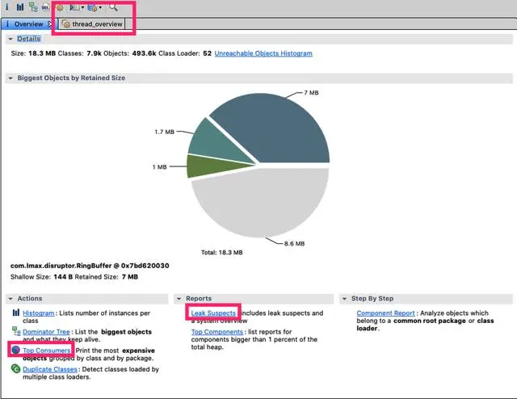

   > another way, 在启动参数中指定-XX:+HeapDumpOnOutOfMemoryError来保存 OOM 时的 dump 文件。

4. gc和线程导致的问题

   gc 问题除了影响 CPU 也会影响内存，排查思路也是一致的。一般先使用 `jstat` 来查看分代变化情况，比如 youngGC 或者 fullGC
   次数是不是太多呀；EU、OU 等指标增长是不是异常呀等。

   线程的话太多而且不被及时 gc 也会引发 oom，大部分就是之前说的`unable to create new native thread`。除了 `jstack` 细细分析
   dump 文件外，我们一般先会看下总体线程，通过`pstreee -p pid |wc -l`。

   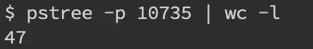

   或者直接通过查看/proc/pid/task的数量即为线程数量。

   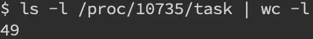

### 堆外内存

堆外内存溢出表现就是物理常驻内存增长快，报错视不同的使用方式来确定。  
堆外内存溢出往往是和 NIO 的使用相关，先通过`pmap` 来查看下进程占用的内存情况`pmap -x pid | sort -rn -k3 | head -30`
，这段意思是查看对应 pid 倒序前 30 大的内存段。可以在一段时间后再跑一次命令看看内存增长情况，或者和正常机器比较可疑的内存段在哪里。

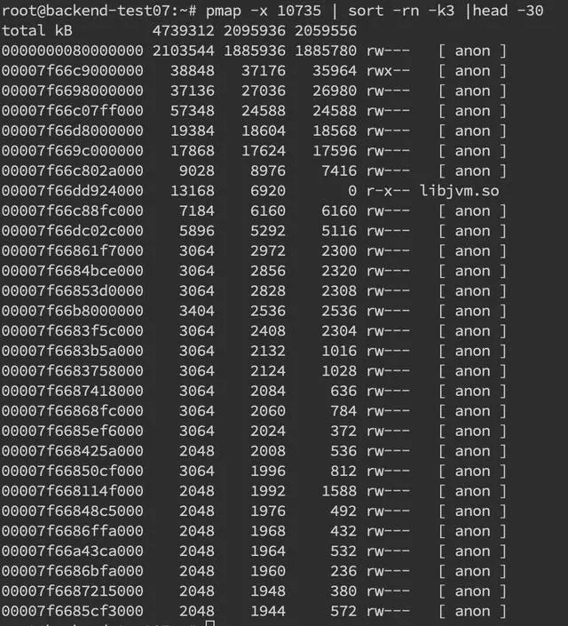

如果确定有可疑的内存端，需要通过 gdb 来分析`gdb --batch --pid {pid} -ex "dump memory filename.dump {内存起始地址}
{内存起始地址+内存块大小}"`

获取 dump 文件后可用 `heaxdump` 进行查看 `hexdump -C filename | less`，不过大多数看到的都是二进制乱码。

NMT 是 Java7U40 引入的 HotSpot 新特性，配合 `jcmd` 命令我们就可以看到具体内存组成了。需要在启动参数中加入   
`-XX: NativeMemoryTracking=summary` 或者 `-XX:NativeMemoryTracking=detail`，会有略微性能损耗。

一般对于堆外内存缓慢增长直到爆炸的情况来说，可以先设一个基线 `jcmd pid VM.native_memory baseline`。

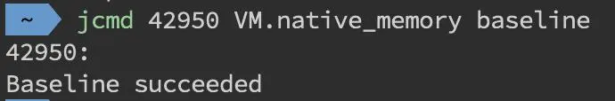

然后等放一段时间后再去看看内存增长的情况，通过`jcmd pid VM.native_memory detail.diff(summary.diff)`做一下 summary 或者
detail 级别的 diff。

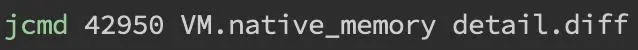
 
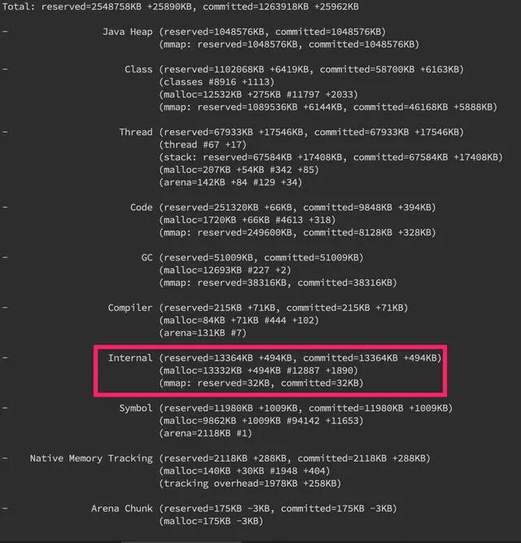

> 重点关注 Internal 的内存增长，如果增长十分明显的话那就是有问题了。

detail 级别的话还会有具体内存段的增长情况，如下图。

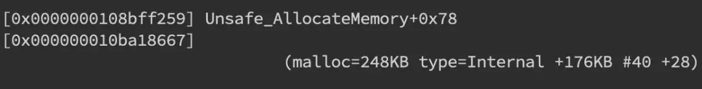

此外在系统层面，我们还可以使用 strace 命令来监控内存分配 `strace -f -e "brk,mmap,munmap" -p pid`

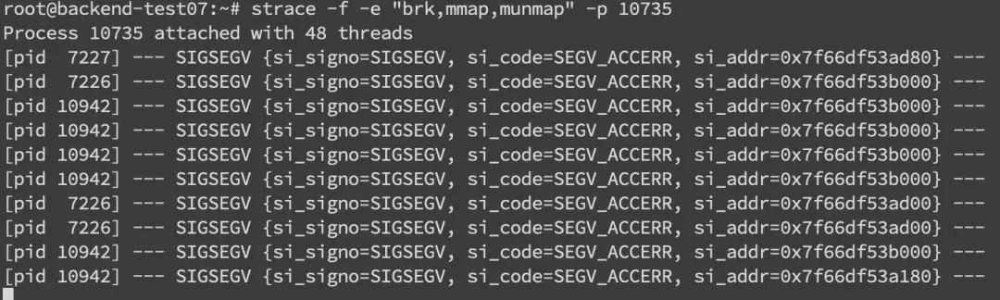

关键还是要看错误日志栈，找到可疑的对象，搞清楚它的回收机制，然后去分析对应的对象。比如 DirectByteBuffer 分配内存的话，是需要
full GC 或者手动 system.gc 来进行回收的(所以最好不要使用-XX:+DisableExplicitGC)。那么其实我们可以跟踪一下
DirectByteBuffer 对象的内存情况，通过`jmap -histo:live pid`手动触发 fullGC
来看看堆外内存有没有被回收。如果被回收了，那么大概率是堆外内存本身分配的太小了，通过  
`-XX: MaxDirectMemorySize`进行调整。如果没有什么变化，那就要使用 `jmap` 去分析那些不能被 gc 的对象，以及和 DirectByteBuffer
之间的引用关系了。

#### GC问题

