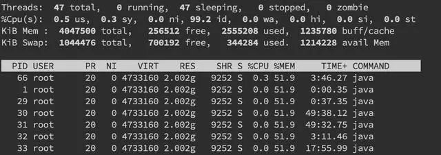
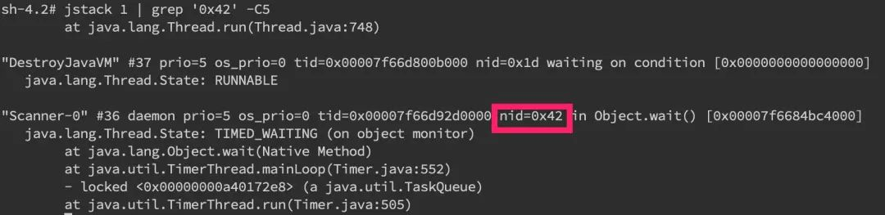

> 线上故障主要会包括 CPU、磁盘、内存以及网络问题，而大多数故障可能会包含不止一个层面的问题，所以进行排查时候尽量四个方面依次排查一遍。同时例如 jstack、jmap 等工具也是不囿于一个方面的问题的，基本上出问题就是 df、free、top 三连，然后依次 jstack、jmap 伺候，具体问题具体分析即可。

## CPU

一般来说先排查CPU方面的问题。原因包括业务逻辑的问题（死循环）、频繁GC以及上下文切换过多。最常见的是业务逻辑，可以使用jstack来分析对应的堆栈情况。

### 使用 jstack 分析 CPU 问题

1. 先用`ps`命令找到对应进程的pid

2. 然后用`top -H -p pid`找到 cpu占用率高的线程

3. 将占用最高的pid 转换为 16进制 `printf '%x\n' pid` 得到 nid

4. 接着直接在 jstack中找到相应的堆栈信息 `jstack pid | grep 'nid' -C5 -color`

需要关注 `WAITING` 和 `TIMED_WAITING` or `BLOCKED` 的部分，可以用命令 `cat jstack.log | grep 'java.lang.Thread.State' | sort -nr | uniq -c` 来对 jstack的状态有一个整体的把握，需要留意 WAITING 之类的特别多的。