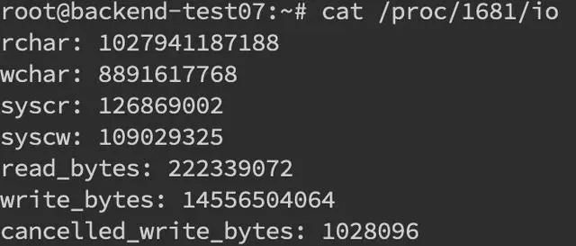

> 线上故障主要会包括 CPU、磁盘、内存以及网络问题，而大多数故障可能会包含不止一个层面的问题，所以进行排查时候尽量四个方面依次排查一遍。同时例如 jstack、jmap 等工具也是不囿于一个方面的问题的，基本上出问题就是 df、free、top 三连，然后依次 jstack、jmap 伺候，具体问题具体分析即可。

## CPU

一般来说先排查CPU方面的问题。原因包括业务逻辑的问题（死循环）、频繁GC以及上下文切换过多。最常见的是业务逻辑，可以使用jstack来分析对应的堆栈情况。

### 使用 jstack 分析 CPU 问题

1. 先用`ps`命令找到对应进程的pid

2. 然后用`top -H -p pid`找到 cpu占用率高的线程

    
3. 将占用最高的pid 转换为 16进制 `printf '%x\n' pid` 得到 nid

    

4. 接着直接在`jstack`中找到相应的堆栈信息 `jstack pid | grep 'nid' -C5 -color`

    

需要关注 `WAITING` 和 `TIMED_WAITING` or `BLOCKED` 的部分，可以用命令 `cat jstack.log | grep 'java.lang.Thread.State' | sort -nr | uniq -c` 来对`jstack`的状态有一个整体的把握，
需要留意 WAITING 之类的特别多的。

   
   
### 频繁 gc

   使用`jstack`来分析问题，需要确定gc是否频繁，使用 `jstat -gc pid 1000`命令来对 gc 分代变化情况进行观察，1000 表示采样间隔（ms），
   S0C/S1C、S0U/S1U、EC/EU、OC/OU、MC/MU 分别代表两个 Survivor 区、Eden 区、老年代、元数据区的容量和使用量。
   YGC/YGT、FGC/FGCT、GCT 则代表 YoungGc、FullGc 的耗时和次数以及总耗时。
   
   
   
### 上下文切换

   可以使用`vmstat`命令来进行查看
   
   
   
   cs(context switch) -> 上下文切换的次数
   
   对特定的pid进行切换可以使用 `pidstat -w pid` 命令，`cswch` 和 `nvcwch` 表示自愿及非自愿切换。
   
   
   
## 磁盘

   磁盘问题和cpu问题一样属于比较基础。首先是从磁盘空间方面，使用 `df -hl` 来查看文件系统状态
   
   
   
   更多时候，磁盘问题是性能上的问题。可以通过 `iostatiostat -d -k -x`来进行分析。
   
   
   
   最后一列 `%util` 可以看到每块磁盘写入的程度，`rrqpm/s` 以及 `wrqm/s` 表示读写速度, 一般就能够定位哪块磁盘出现问题了。
   
   > 有时候需要知道哪个进程在进行读写，使用 `iotop` 来进行定位文件读写的来源。
   
   

   拿到 tid 需要转换成 pid，可以通过 `readlinke` 找到 `pidreadlink -f /proc/*/task/../..`

   
   
   找到 pid 之后就可以看到进程的具体读写情况 `cat /proc/pid/io`
   
