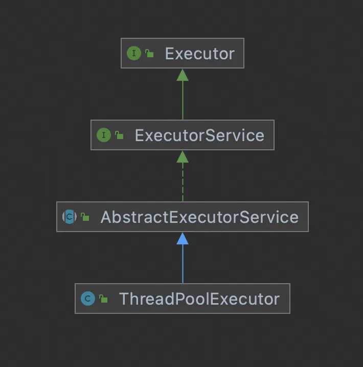
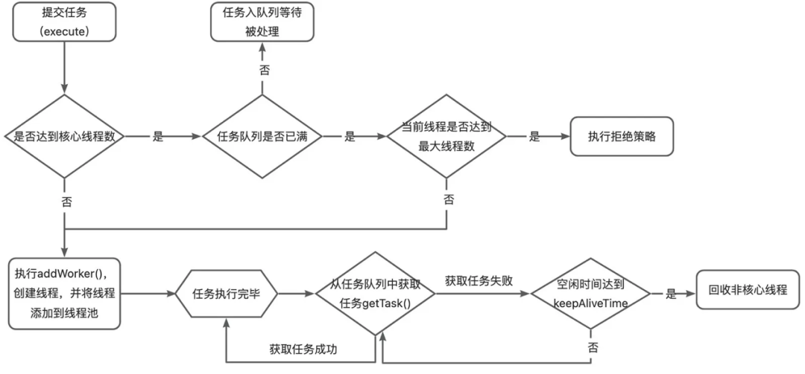

> 本文讲述了Java线程池的实现原理和源码分析以及线程池在业务中的最佳实践。

# <div style="text-align: center;">一、线程池简介</div>

## 1. 什么是线程池？

**线程池是一种用于管理和复用线程的机制。**

线程池的核心思想是预先创建一定数量的线程，并把它们保存在线程池中，当有任务需要执行时，线程池会从空闲线程中取出一个线程来执行该任务。当任务执行完毕后，线程不是被销毁，而是返还给线程池，可以立即或稍后被再次用来执行其他热为奴。这种机制可以避免频繁创建和销毁线程带来的性能开销，同时也能控制同时运行的线程数量，从而提高系统的性能和资源利用率。

线程池的主要组成部分包括工作线程、任务队列、线程管理器等。线程池的设计有助于优化多线程程序的性能和资源利用，同时简化了线程的管理和复用的复杂性。

## 2. 线程池有什么好处？

+ 减少线程创建和销毁的开销，线程的创建和销毁需要消耗系统资源，线程池通过复用线程，避免了对资源的频繁操作，从而提高系统性能；
+ 控制和优化系统资源利用，线程池通过控制线程的数量，可以尽可能地压榨机器性能，提高系统资源利用率；
+ 提高响应速度，线程池可以预先创建线程且通过多线程并发处理任务，提升任务的响应速度及系统的并发性能；

# <div style="text-align: center;">二、Java线程池的实现原理</div>

## 1. 类继承关系

Java线程池的核心实现类是ThreadPoolExecutor,其类继承关系如图所示，其中的核心方法如下图：



**ThreadPoolExecutor的部分核心方法**

```text
execute(Runnable r):没有返回值，仅仅是把一个任务提交给线程池处理

submit(Runnable r):返回值为Future类型，当任务处理完毕后，通过Future的get()方法获取返回值时候，得到的是null

submit(Runnable r,Object result):返回值为Future类型，当任务处理完毕后，通过Future的get()方法获取返回值时候，得到的是传入的第二个参数result

shutdown():关闭线程池，不接受新任务，但是等待队列中的任务处理完毕才能真正关闭

shutdownNow():立即关闭线程池，不接受新任务，也不再处理等待队列中的任务，同时中断正在执行的线程

setCorePoolSize(int corePoolSize):设置核心线程数

setKeepAliveTime(long time, TimeUnit unit):设置线程的空闲时间

setMaximumPoolSize(int maximumPoolSize):设置最大线程数

setRejectedExecutionHandler(RejectedExecutionHandler rh):设置拒绝策略

setThreadFactory(ThreadFactory tf):设置线程工厂

beforeExecute(Thread t, Runnable r):任务执行之前的钩子函数，这是一个空函数，使用者可以继承ThreadPoolExecutor后重写这个方法，实现其中的逻辑

afterExecute(Runnable r, Throwable t):任务执行之后的钩子函数，这是一个空函数，使用者可以继承ThreadPoolExecutor后重写这个方法，实现其中的逻辑
```

## 2. 线程池的状态

+ **RUNNING：** 线程池一旦被创建，就处于RUNNING状态，任务数为0，能够接收新任务，对已排队的任务进行处理。
+ **SHUTDOWN： 不接收新任务，但能处理已排队的任务。** 当调用线程池的shutdown()方法时，线程池会由RUNNING转变为SHUTDOWN状态。
+ **STOP：** 不接收新任务，不处理已排队的任务，并且会中断正在处理的任务。当调用线程池的shutdownNow()
  方法时，线程池会由RUNNING或SHUTDOWN转变为STOP状态。
+ **TIDYING：**
  当线程池在SHUTDOWN状态下，任务队列为空且执行中任务为空，或者线程池在STOP状态下，线程池中执行中任务为空时，线程池会变为TIDYING状态，会执行terminated()
  方法。这个方法在线程池中是空实现，可以重写该方法进行相应的处理。
+ **TERMINATED：** 线程池彻底终止。线程池在TIDYING状态执行完terminated()方法后，就会由TIDYING转变为TERMINATED状态。

## 3.线程池的执行流程



## 4.问题思考

+ 线程池的核心线程可以回收吗？

**问题分析与解答**

> ThreadPoolExecutor默认不回收核心线程，但是提供了allowCoreThreadTimeOut(boolean value)
> 方法，当参数为true时，可以在达到线程空闲时间后，回收核心线程，在业务代码中，如果线程池是周期性的使用，可以考虑将该参数设置为true；

+ 线程池在提交任务前，可以提前创建线程吗？

**问题分析与解答**

ThreadPoolExecutor提供了两个方法：

**prestartCoreThread():** 启动一个线程，等待任务，如果核心线程数已达到，这个方法返回false，否则返回true；

**prestartAllCoreThreads():** 启动所有的核心线程，返回启动成功的核心线程数；

通过这种设置，可以在提交任务前，完成核心线程的创建，从而实现线程池预热的效果；

