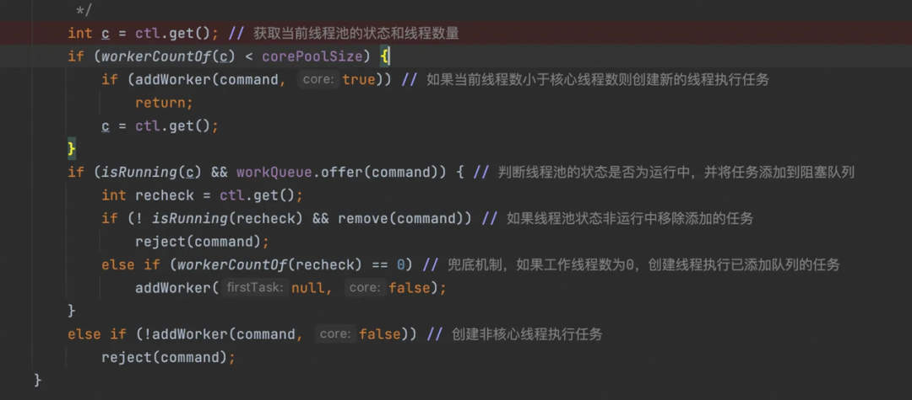
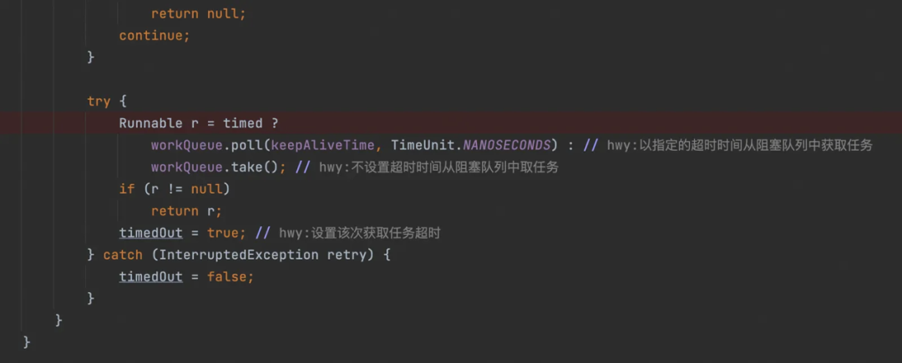

> 本文讲述了Java线程池的实现原理和源码分析以及线程池在业务中的最佳实践。
> 原文链接：https://mp.weixin.qq.com/s/icrrxEsbABBvEU0Gym7D5Q

# <div style="text-align: center;">一、线程池简介</div>

## 1.什么是线程池？

**线程池是一种用于管理和复用线程的机制。**

线程池的核心思想是预先创建一定数量的线程，并把它们保存在线程池中，当有任务需要执行时，线程池会从空闲线程中取出一个线程来执行该任务。当任务执行完毕后，线程不是被销毁，而是返还给线程池，可以立即或稍后被再次用来执行其他热为奴。这种机制可以避免频繁创建和销毁线程带来的性能开销，同时也能控制同时运行的线程数量，从而提高系统的性能和资源利用率。

线程池的主要组成部分包括工作线程、任务队列、线程管理器等。线程池的设计有助于优化多线程程序的性能和资源利用，同时简化了线程的管理和复用的复杂性。

## 2.线程池有什么好处？

+ 减少线程创建和销毁的开销，线程的创建和销毁需要消耗系统资源，线程池通过复用线程，避免了对资源的频繁操作，从而提高系统性能；
+ 控制和优化系统资源利用，线程池通过控制线程的数量，可以尽可能地压榨机器性能，提高系统资源利用率；
+ 提高响应速度，线程池可以预先创建线程且通过多线程并发处理任务，提升任务的响应速度及系统的并发性能；

# <div style="text-align: center;">二、Java线程池的实现原理</div>

## 1.类继承关系

Java线程池的核心实现类是ThreadPoolExecutor,其类继承关系如图所示，其中的核心方法如下图：


**ThreadPoolExecutor的部分核心方法**

```text
execute(Runnable r):没有返回值，仅仅是把一个任务提交给线程池处理

submit(Runnable r):返回值为Future类型，当任务处理完毕后，通过Future的get()方法获取返回值时候，得到的是null

submit(Runnable r,Object result):返回值为Future类型，当任务处理完毕后，通过Future的get()方法获取返回值时候，得到的是传入的第二个参数result

shutdown():关闭线程池，不接受新任务，但是等待队列中的任务处理完毕才能真正关闭

shutdownNow():立即关闭线程池，不接受新任务，也不再处理等待队列中的任务，同时中断正在执行的线程

setCorePoolSize(int corePoolSize):设置核心线程数

setKeepAliveTime(long time, TimeUnit unit):设置线程的空闲时间

setMaximumPoolSize(int maximumPoolSize):设置最大线程数

setRejectedExecutionHandler(RejectedExecutionHandler rh):设置拒绝策略

setThreadFactory(ThreadFactory tf):设置线程工厂

beforeExecute(Thread t, Runnable r):任务执行之前的钩子函数，这是一个空函数，使用者可以继承ThreadPoolExecutor后重写这个方法，实现其中的逻辑

afterExecute(Runnable r, Throwable t):任务执行之后的钩子函数，这是一个空函数，使用者可以继承ThreadPoolExecutor后重写这个方法，实现其中的逻辑
```

## 2.线程池的状态

+ **RUNNING：** 线程池一旦被创建，就处于RUNNING状态，任务数为0，能够接收新任务，对已排队的任务进行处理。
+ **SHUTDOWN： 不接收新任务，但能处理已排队的任务。** 当调用线程池的shutdown()方法时，线程池会由RUNNING转变为SHUTDOWN状态。
+ **STOP：** 不接收新任务，不处理已排队的任务，并且会中断正在处理的任务。当调用线程池的shutdownNow()
  方法时，线程池会由RUNNING或SHUTDOWN转变为STOP状态。
+ **TIDYING：**
  当线程池在SHUTDOWN状态下，任务队列为空且执行中任务为空，或者线程池在STOP状态下，线程池中执行中任务为空时，线程池会变为TIDYING状态，会执行terminated()
  方法。这个方法在线程池中是空实现，可以重写该方法进行相应的处理。
+ **TERMINATED：** 线程池彻底终止。线程池在TIDYING状态执行完terminated()方法后，就会由TIDYING转变为TERMINATED状态。

## 3.线程池的执行流程


## 4.问题思考

+ 线程池的核心线程可以回收吗？

**问题分析与解答**

> `ThreadPoolExecutor`默认不回收核心线程，但是提供了`allowCoreThreadTimeOut(boolean value)`
> 方法，当参数为true时，可以在达到线程空闲时间后，回收核心线程，在业务代码中，如果线程池是周期性的使用，可以考虑将该参数设置为true；

+ 线程池在提交任务前，可以提前创建线程吗？

**问题分析与解答**

`ThreadPoolExecutor`提供了两个方法：

**`prestartCoreThread()`:** 启动一个线程，等待任务，如果核心线程数已达到，这个方法返回false，否则返回true；

**`prestartAllCoreThreads()`:** 启动所有的核心线程，返回启动成功的核心线程数；

通过这种设置，可以在提交任务前，完成核心线程的创建，从而实现线程池预热的效果；

# <div style="text-align: center;">三、源码分析</div>

## **1.execute(Runnable command)**

首先会获取ctl,ctl由32位组成，高3位记录了线程池的状态，低29位记录了线程池中工作线程的数量；拿到ctl后判断当前工作线程数是否小于核心线程数，小于则创建核心线程执行任务，否则则尝试将任务添加到任务队列中，如果添加任务队列失败，尝试创建非核心线程执行任务。



## 2.addWorker(Runnable firstTask, boolean core)

在双层死循环中，依然是获取ctl,校验当前线程池的状态，校验通过后，会在内层死循环中尝试cas增加工作线程数量，只有增加成功才能跳出外层for循环，真正开始创建线程。


创建线程需要加锁保证并发安全，线程池中使用Worker类封装Thread对象，在线程池运行中或shutdown状态均可创建线程并执行阻塞队列中的任务。


线程创建成功并添加到线程池后，会调用start()方法，启动线程，执行任务。


## 3.runWorker(Worker w)

在runWorker()方法中，首先会以Worker中封装的任务作为第一个任务，并在while()
循环中不断从阻塞队列中获取任务执行，实现线程的复用，这里有一个细节，源码是直接抛出了task.run()方法执行的异常，并没有进行捕获。


## 4.getTask()

校验线程池状态，如果是非运行状态，且不是`shutdown`且阻塞队列不为空时对工作线程数-1，并返回
null，注意这里只是对工作线程数-1，并没有真正的销毁线程，销毁线程的逻辑收敛在`processWorkerExit();`


根据是否需要超时控制，提供两个阻塞方法获取阻塞队列中的任务。



## 5.processWorkerExit(w, completedAbruptly)

当线程执行异常或者获取不到阻塞任务时，会进入该方法。


# <div style="text-align: center;">四、线程池在业务中的最佳实践</div>

## 1.如何选择合适的线程池参数

```text
public ThreadPoolExecutor(int corePoolSize,
        int maximumPoolSize,
        long keepAliveTime,
        TimeUnit unit,
        BlockingQueue<Runnable> workQueue,
        ThreadFactory threadFactory,
        RejectedExecutionHandler handler) 
```

**线程池的核心参数**

```text
1.corePoolSize:  核心线程数

2.maximumPoolSize:  最大线程数

3.keepAliveTime:  线程的空闲时间

4.unit:  空闲时间的单位（秒、分、小时等等）

5.workQueue:  等待队列

6.threadFactory:  线程工厂

7.handler:  拒绝策略

ThreadPoolExecutor.AbortPolicy:丢弃任务并抛出RejectedExecutionException异

ThreadPoolExecutor.DiscardPolicy：也是丢弃任务，但是不抛出异常

ThreadPoolExecutor.DiscardOldestPolicy：丢弃队列最前面的任务，然后重新尝试执行任务（重复此过程）

ThreadPoolExecutor.CallerRunsPolicy：由调用线程直接处理该任务（可能为主线程Main），保证每个任务执行完毕
```

**推荐使用自定义的线程工厂，重写创建线程的方法，支持自定义创建线程的名称、优先级等属性，方便排查问题；**

**问题思考**

+ **如何选择合适的线程池参数？**

    + 1）根据任务场景选择

      > CPU 密集型任务(N+1)： 这种任务消耗的主要是 CPU 资源，可以将线程数设置为 N（CPU 核心数）+1。比 CPU
      > 核心数多出来的一个线程是为了防止线程偶发的缺页中断，或者其它原因导致的任务暂停而带来的影响。一旦任务暂停，CPU
      > 就会处于空闲状态，而在这种情况下多出来的一个线程就可以充分利用 CPU 的空闲时间；
      >
      > I/O 密集型任务(2N)： 这种任务应用起来，系统会用大部分的时间来处理 I/O 交互，而线程在处理 I/O 的时间段内不会占用 CPU
      > 来处理，这时就可以将 CPU 交出给其它线程使用。因此在 I/O 密集型任务的应用中，我们可以多配置一些线程，具体的计算方法是
      2N；

    + 2）根据线程池用途选择

      > 用途一：快速响应用户请求
      比如说用户查询商品详情页，会涉及查询商品关联的一系列信息如价格、优惠、库存、基础信息等，站在用户体验的角度，希望商详页的响应时间越短越好，此时可以考虑使用线程池并发地查询价格、优惠、库存等信息，再聚合结果返回，降低接口总rt。这种线程池用途追求的是最快响应速度，所以可以考虑不设置队列去缓冲并发任务，而是尽可能设置更大的corePoolSize和maxPoolSize;
      >
      > 用途二：快速处理批量任务
      比如说项目中在对接渠道同步商品供给时，需要查询大量的商品数据并同步给渠道，此时可以考虑使用线程池快速处理批量任务。这种线程池用途关注的是如何使用有限的机器资源，尽可能地在单位时间内处理更多的任务，提升系统吞吐量，所以需要设置阻塞队列缓冲任务，并根据任务场景调整合适的corePoolSize；

## 2.如何正确地创建线程池对象

**使用Executors创建特定的线程池，线程池参数比较固定，不推荐使用。**

Executors是一个java.util.concurrent包中的工具类，可以方便的为我们创建几种特定参数的线程池。

+ FixedThreadPool:具有固定线程数量的线程池，无界阻塞队列；
+ CachedThreadPool:线程数量可以动态伸缩的线程池,最大线程数为Integer.MAX_VALUE
+ SingleThreadPool:单个线程的线程，核心线程数和最大线程数都是1，无界阻塞队列

推荐使用饿汉式的单例模式创建线程池对象，支持灵活的参数配置，在类加载阶段即完成线程池对象的创建，且只会实例化一个对象，再封装统一的获取线程池对象的方法，暴露给业务代码使用，参考代码：

```java
public class TestThreadPool {

    /**
     * 线程池
     */
    private static ExecutorService executor = initDefaultExecutor();

    /**
     * 统一的获取线程池对象方法
     */
    public static ExecutorService getExecutor() {
        return executor;
    }

    private static final int DEFAULT_THREAD_SIZE = 16;
    private static final int DEFAULT_QUEUE_SIZE  = 10240;

    private static ExecutorService initDefaultExecutor() {
        return new ThreadPoolExecutor(DEFAULT_THREAD_SIZE, DEFAULT_THREAD_SIZE,
                300, TimeUnit.SECONDS,
                new ArrayBlockingQueue<>(DEFAULT_QUEUE_SIZE),
                new DefaultThreadFactory(),
                new ThreadPoolExecutor.CallerRunsPolicy());
    }
}

```


