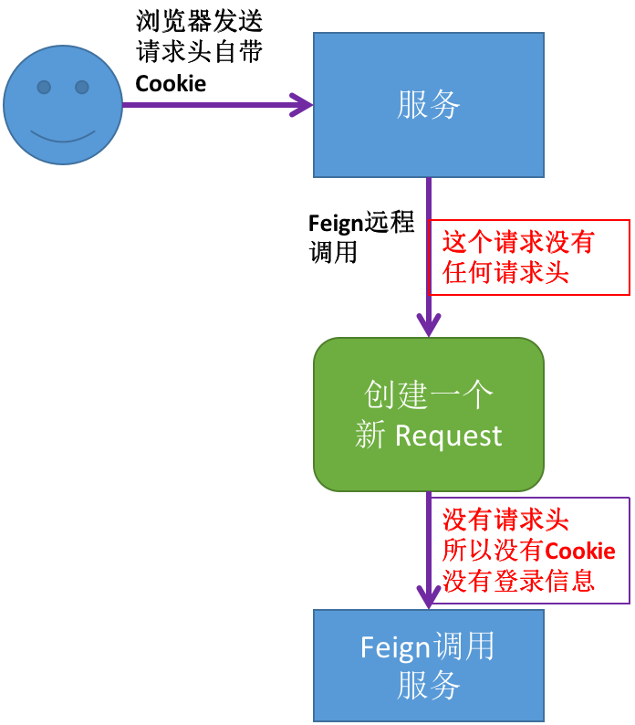
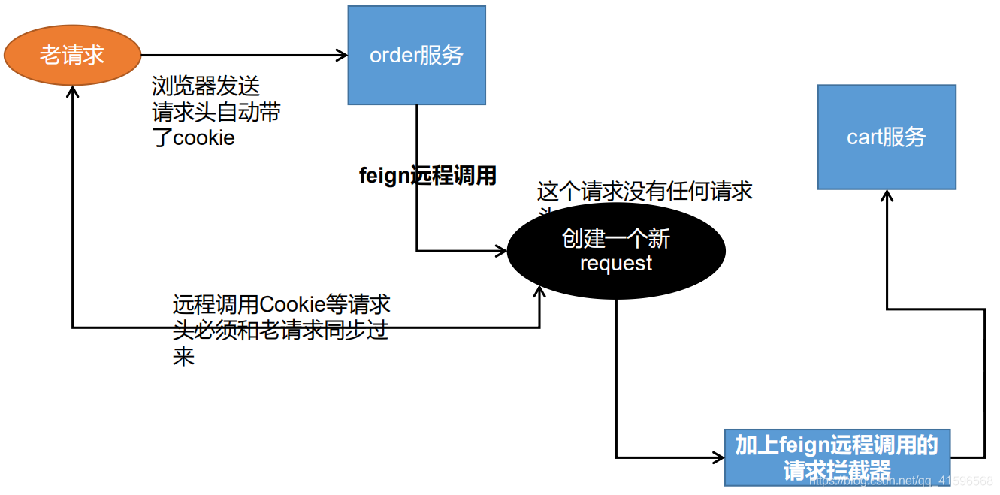
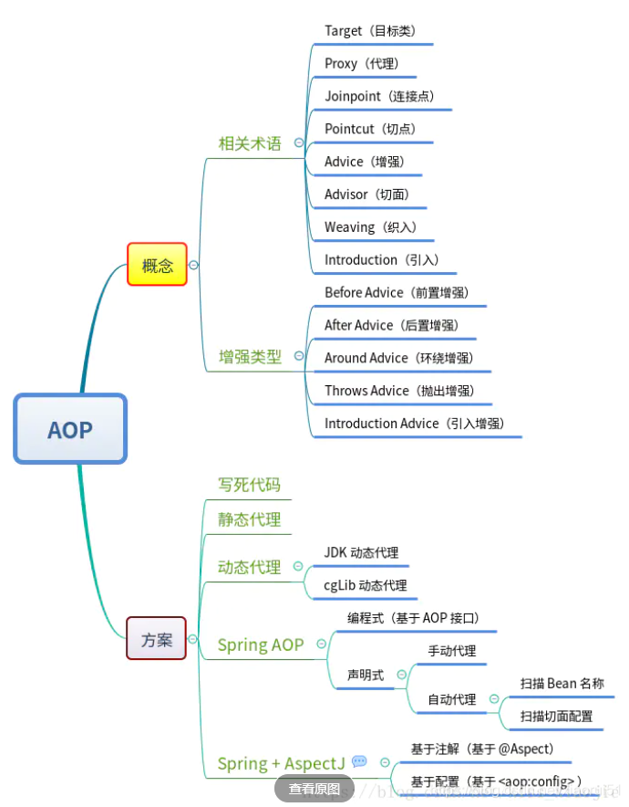

## vue的ref的用法

## 设计一个多对多的数据库

## 序列化和反序列化的区别

## 浅拷贝与深拷贝的区别

    浅拷贝是指拷贝时只拷贝对象本身，而不拷贝对象包含的引用所指向的对象
    拷贝不仅拷贝对象本身，而且拷贝对象引用所指向的对象
    java中常用常用的拷贝对象有三种 1. 操作符= 2.拷贝构造函数 3.clone()方法

## spring cloud中feign的请求头丢失怎么解决

> feign在远程调用时，会重新包装请求（请求路径、请求参数）但是不会携带请求头

```java

@Override
public Object invoke(Object[] argv) throws Throwable {
    RequestTemplate template = buildTemplateFromArgs.create(argv);
    Options         options  = findOptions(argv);
    Retryer         retryer  = this.retryer.clone();
    while (true) {
        try {
            return executeAndDecode(template, options);
        } catch (RetryableException e) {
            try {
                retryer.continueOrPropagate(e);
            } catch (RetryableException th) {
                Throwable cause = th.getCause();
                if (propagationPolicy == UNWRAP && cause != null) {
                    throw cause;
                } else {
                    throw th;
                }
            }
            if (logLevel != Logger.Level.NONE) {
                logger.logRetry(metadata.configKey(), logLevel);
            }
            continue;
        }
    }
}

```



> 利用feign拦截器，手动添加请求头



```java

@Configuration
public class FeignConfig {

    /**
     * 解决fein远程调用丢失请求头
     * @return
     */
    @Bean("requestInterceptor")
    public RequestInterceptor requestInterceptor() {
        return new RequestInterceptor() {
            @Override
            public void apply(RequestTemplate template) {
                // 1、RequestContextHolder 拿到当前的请求
                ServletRequestAttributes attributes = (ServletRequestAttributes) RequestContextHolder.getRequestAttributes();
                if (attributes != null) {
                    // 原始请求 页面发起的老请求
                    HttpServletRequest request = attributes.getRequest();
                    if (request != null) {
                        // 获取原始请求的头数据 cookie
                        String cookie = request.getHeader("Cookie");
                        // 给feign生成的心请求设置请求头cookie
                        template.header("Cookie", cookie);
                    }
                }
            }
        };
    }
}

```

> 异步调用丢失请求头的问题：让每个异步的线程共享ThreadLocal数据

```java
  /**
 * 解决异步任务拿不到ThreadLocal里的数据
 * 获取之前的请求，让每个异步任务的线程共享ThreadLocal数据
 */
RequestAttributes requestAttributes = RequestContextHolder.getRequestAttributes();

CompletableFuture<Void> getAddressTask = CompletableFuture.runAsync(() -> {
    // 解决异步任务拿不到ThreadLocal里的数据
    RequestContextHolder.setRequestAttributes(requestAttributes);

    //...
}, executor);

```

参考链接：https://zhuanlan.zhihu.com/p/92776342

## threadLocal

使用场景：

1. 存储用户的session
2. 数据库链接，处理数据库事务
3. 数据跨层传递
4. Spring使用ThreadLocal解决线程安全问题

## redis内存不足如何解决

## spring的核心概念

ioc和aop

## aop的基本用法



## mybatis中${}和#{}的区别

    # 可以实现预编译，会先把#{变量}编译成?，在执行时再取值，可以防止sql注入
    需要在sql映射文件中动态拼接sql时的开发场景
    $ 直接进行字符串替换
    用于传入的参数是sql片段的场景下，会直接进行字符串替换，完成了sql的拼接

    $的使用场景？
    动态查询，用户可能需要展示不同的列，不展示哪些列，或者通过权限分配来分配不同的用户可以看到哪些列

## 实操，读取文件夹里的所有文件夹，并遍历所有文件夹输出

```java
package cn.edu.xjtu;

import java.io.File;
import java.util.ArrayList;
import java.util.List;

public class test {

    public static void main(String[] args) {

        String basePath = "D:\\code\\java\\typoraImgTypeTrans";
        File dir = new File(basePath);

        List<File> allFileList = new ArrayList<>();

        // 判断文件夹是否存在
        if (!dir.exists()) {
            System.out.println("目录不存在");
            return;
        }

        getAllFile(dir, allFileList);

        for (File file : allFileList) {
            System.out.println(file.getName());
        }
        System.out.println("该文件夹下共有" + allFileList.size() + "个文件");
    }

    public static void getAllFile(File fileInput, List<File> allFileList) {
        // 获取文件列表
        File[] fileList = fileInput.listFiles();
        assert fileList != null;
        for (File file : fileList) {
            if (file.isDirectory()) {
                // 递归处理文件夹
                // 如果不想统计子文件夹则可以将下一行注释掉
                getAllFile(file, allFileList);
            } else {
                // 如果是文件则将其加入到文件数组中
                allFileList.add(file);
            }
        }
    }
}

```


